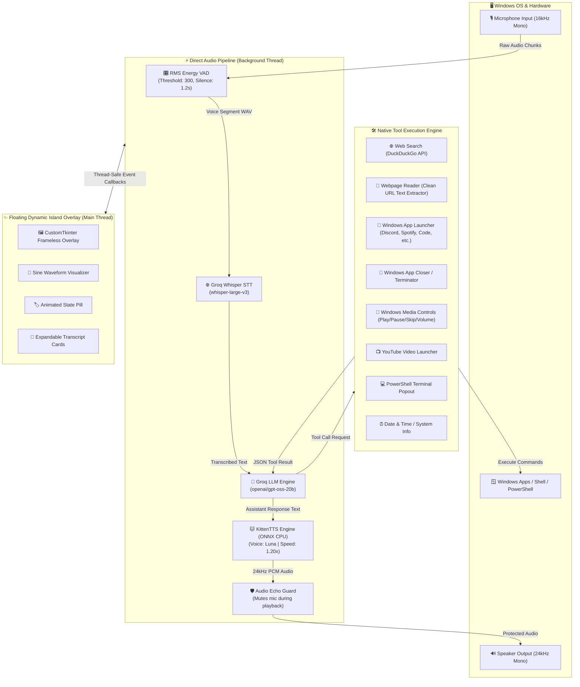
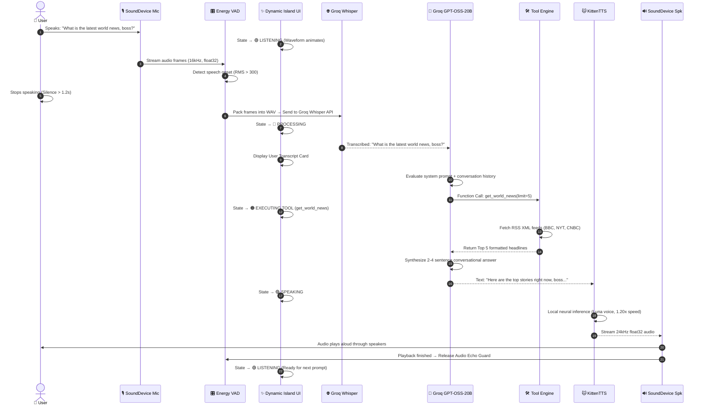
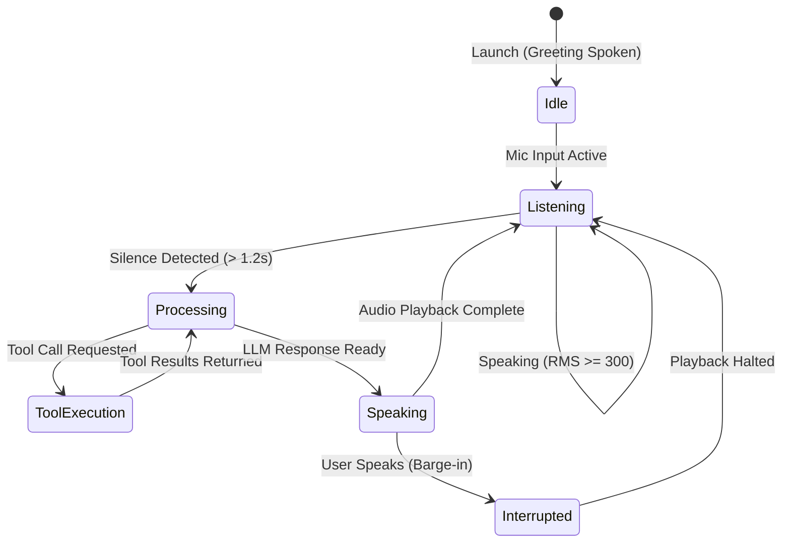
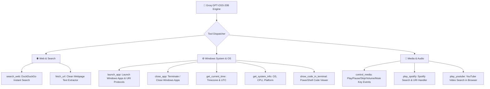

# 🏗️ Claire: Visual Architecture & System Design

> **Claire** is an ultra-fast, local-first conversational voice assistant for Windows with a native floating Dynamic Island interface, cloud-accelerated LLM reasoning (Groq GPT-OSS-20B), and lightweight offline neural speech synthesis (KittenTTS).

---

## 1. High-Level System Architecture



---

## 2. Interactive End-to-End Sequence Diagram



---

## 3. Concurrency & Threading Model

Claire uses an asynchronous, decoupled multi-threaded architecture ensuring **zero UI freezing** and **low-latency audio streaming**:

```mermaid
graph LR
    subgraph MainThread ["🧵 Main Thread: CustomTkinter GUI"]
        TK["Tkinter event loop (root.mainloop)"]
        DRAW["Waveform canvas redrawing (~30 FPS)"]
        UI_QUEUE["Thread-safe Event Queue (root.after)"]
    end

    subgraph AudioThread ["🧵 Audio Worker Thread: DirectPipeline"]
        STREAM["sounddevice.InputStream (Non-blocking)"]
        VAD_LOOP["RMS Energy calculation loop"]
        NET_WORKER["HTTPX Async Worker (Groq STT & LLM)"]
        TTS_WORKER["ONNX Inference Worker (KittenTTS)"]
    end

    STREAM -->|Audio Frames| VAD_LOOP
    VAD_LOOP -->|Audio Buffer| NET_WORKER
    NET_WORKER -->|Text| TTS_WORKER
    
    AudioThread -->|emit(event, text)| UI_QUEUE
    UI_QUEUE -->|Dispatched to| TK
```

---

## 4. State Machine Diagram



---

## 5. Built-in Tool Ecosystem
 
Claire features 10 native tools executed directly within the agent process with zero third-party bridge servers:




---

## 6. Dynamic Island UI Anatomy

```
┌──────────────────────────────────────────────────────────────┐
│  🟢 LISTENING  │  💬 "What's the weather today?"  │  ✕ Close │
├──────────────────────────────────────────────────────────────┤
│               ~~~ ∿∿∿ Animated Sine Wave ∿∿∿ ~~~             │
├──────────────────────────────────────────────────────────────┤
│  [User Card]: "What's the weather today?"                    │
│  [Claire Card]: "It's sunny and 24 degrees in the city, boss"│
└──────────────────────────────────────────────────────────────┘
```

- **Top Bar**: Pill indicator with status color (🟢 Listening, 🔵 Thinking, 🟠 Working, 🟣 Speaking).
- **Center Canvas**: Math-driven live sine wave dynamically reacting to audio state.
- **Transcript Stack**: Collapsible history cards showing real-time user questions and Claire's responses.
- **Window Behavior**: Topmost floating window (`-topmost`), frameless, draggable, with subtle rounded corner aesthetic.

---

## 7. Component & Technology Stack

| Layer | Technology | Function |
|:---|:---|:---|
| **Audio Input** | `sounddevice` | Direct 16 kHz mono microphone capture |
| **VAD Engine** | RMS Energy Thresholding | Real-time voice activity chunking & silence timeout |
| **Speech-to-Text** | Groq Whisper (`whisper-large-v3`) | Sub-second cloud speech transcription |
| **Intelligence** | Groq `openai/gpt-oss-20b` | High-speed LLM reasoning, personality, and tool routing |
| **Speech Synthesis** | `KittenTTS` (`kitten-tts-mini-0.8`) | Lightweight CPU ONNX acoustic model & vocoder |
| **Voice Preset** | `Luna` @ 1.20x Speed | Natural, conversational, and lively female voice |
| **User Interface** | `customtkinter` | Modern Windows floating overlay UI |
| **Packaging & CLI** | `pyproject.toml` + `requirements.txt` | Standard `-e .` installable `claire` terminal command |
