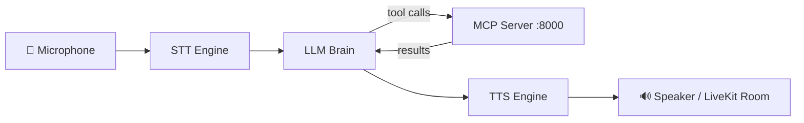
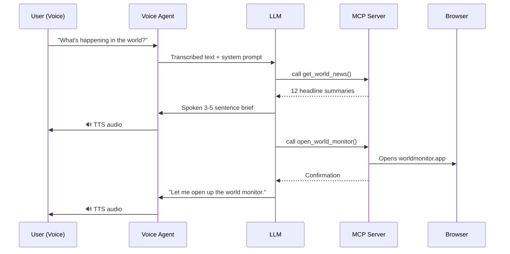
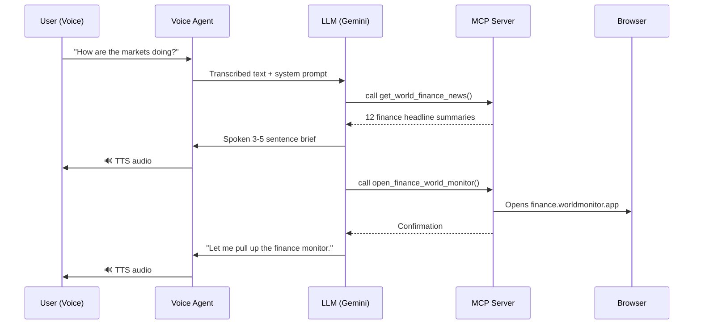

# 📋 Product Requirements Document (PRD)
# claire — Build Blueprint

> **Purpose**: This document captures *every* feature, behavior, and architectural decision for the Claire project so you can rebuild it from scratch, your own way.

---

## 1. Product Overview

### 1.1 What It Is
A **real-time AI voice assistant** that listens to your microphone, reasons with an LLM, calls tools (fetch news, open dashboards, get system info, launch apps, play music, open YouTube videos, run terminal commands), and speaks back to you — all in real-time with a custom personality. Runs **100% locally on Windows** with no paid API subscriptions required (except a free Groq API key for the LLM).

### 1.2 Two-Process Architecture
The system runs as **two separate processes** that must run simultaneously:



| Process | Role | Transport |
|---------|------|-----------|
| **MCP Server** | Backend that exposes tools, prompts, and resources | SSE on `http://127.0.0.1:8000/sse` |
| **Voice Agent** | Real-time voice pipeline (STT → LLM → TTS) that consumes tools from MCP | LiveKit WebRTC room |

> [!IMPORTANT]
> Both processes must run **simultaneously**. The voice agent calls the MCP server in real-time whenever the LLM decides to use a tool.

---

## 2. System Architecture

### 2.1 MCP Server (Backend)

**Framework**: FastMCP  
**Transport**: SSE (Server-Sent Events) on port `8000`  
**Structure**: Modular registry pattern

```
mcp_server/
├── server.py              # Entry point — creates FastMCP instance, registers everything
├── config.py              # Env-var loading, app-wide settings (Config class)
├── tools/                 # MCP tools (callable by LLM)
│   ├── __init__.py        # register_all_tools(mcp) — central registry
│   ├── web.py             # News, finance, search, URL fetch, dashboard openers
│   ├── system.py          # Time, system info
│   ├── utils.py           # JSON formatting, word count
│   └── os_control.py      # App launcher, Spotify, YouTube, terminal popup, VS Code
├── prompts/               # MCP prompt templates
│   ├── __init__.py        # register_all_prompts(mcp)
│   └── templates.py       # summarize, explain_code
└── resources/             # MCP resources
    ├── __init__.py        # register_all_resources(mcp)
    └── data.py            # claire://info static resource
```

**Server initialization flow:**
1. Create `FastMCP(name="Claire", instructions="...")`
2. Call `register_all_tools(mcp)` — imports and registers all tool modules
3. Call `register_all_prompts(mcp)` — imports and registers prompt templates
4. Call `register_all_resources(mcp)` — imports and registers resources
5. Run with `mcp.run(transport='sse')`

**Config class** loads from `.env`:
- `SERVER_NAME` (default: `"Claire"`)
- `DEBUG` (default: `false`)
- `GROQ_API_KEY`

### 2.2 Voice Agent (Frontend)

**Framework**: LiveKit Agents  
**Pipeline**: STT → LLM → TTS (with VAD)

**Key class**: `ClaireAgent(Agent)` — inherits from LiveKit's `Agent`
- Receives `instructions` (system prompt), `stt`, `llm`, `tts`, `vad`
- Connects to MCP server via `MCPServerHTTP` with SSE transport
- Has an `on_enter()` method that auto-greets the user

**Session config:**
- `turn_detection`: `"vad"` (Silero VAD, always used with Vosk)
- `min_endpointing_delay`: `0.3s`

---

## 3. Feature Specifications

### 3.1 MCP Tools (13 Total)

#### 🌍 Tool: `get_world_news`
| Property | Detail |
|----------|--------|
| **Type** | Async |
| **Input** | None |
| **Output** | Formatted markdown string with headlines |
| **Data Sources** | 4 RSS feeds fetched **in parallel** via `asyncio.gather()` |
| **RSS Feeds** | BBC World, CNBC World, NYT World, Al Jazeera |
| **Behavior** | Fetches top 5 items per feed → flattens → returns top 12 total |
| **Format** | `**[SOURCE]** Title\nSummary (max 200 chars)...\nLink: url` |
| **Error** | Returns: `"The global news grid is unresponsive, sir."` |

**RSS Feed URLs:**
```
https://feeds.bbci.co.uk/news/world/rss.xml
https://www.cnbc.com/id/100727362/device/rss/rss.html
https://rss.nytimes.com/services/xml/rss/nyt/World.xml
https://www.aljazeera.com/xml/rss/all.xml
```

**Feed parsing logic:**
1. HTTP GET with `User-Agent: Claire-AI/1.0`, timeout 5s
2. Parse XML, find all `<item>` elements
3. Extract `title`, `description` (strip HTML tags via regex), `link`
4. Truncate description to 200 chars
5. Source name extracted from URL domain (e.g., `BBC`, `CNBC`)

---

#### 💰 Tool: `get_world_finance_news`
| Property | Detail |
|----------|--------|
| **Type** | Async |
| **Input** | None |
| **Output** | Formatted markdown string with finance headlines |
| **Data Sources** | 5 RSS feeds fetched in parallel |
| **Behavior** | Identical to `get_world_news` but uses finance feeds |
| **Error** | Returns: `"The financial feeds are unresponsive right now, sir."` |

**Finance RSS Feed URLs:**
```
https://www.cnbc.com/id/10000664/device/rss/rss.html        (CNBC Finance)
https://feeds.bloomberg.com/markets/news.rss                 (Bloomberg Markets)
https://www.reutersagency.com/feed/?taxonomy=best-sectors&post_type=best  (Reuters)
https://feeds.marketwatch.com/marketwatch/topstories/        (MarketWatch)
https://rss.nytimes.com/services/xml/rss/nyt/Business.xml    (NYT Business)
```

---

#### 🌐 Tool: `open_world_monitor`
| Property | Detail |
|----------|--------|
| **Type** | Async |
| **Input** | None |
| **Output** | Confirmation string |
| **Behavior** | Opens `https://worldmonitor.app/` in the system's default web browser |
| **Success** | `"Displaying the World Monitor on your primary screen now, sir."` |
| **Error** | `"I'm unable to initialize the visual monitor: {error}"` |

---

#### 📊 Tool: `open_finance_world_monitor`
| Property | Detail |
|----------|--------|
| **Type** | Async |
| **Input** | None |
| **Output** | Confirmation string |
| **Behavior** | Opens `https://finance.worldmonitor.app/` in the system's default browser |
| **Success** | `"Displaying the Finance World Monitor on your primary screen now, sir."` |
| **Error** | `"I'm unable to initialize the finance monitor: {error}"` |

---

#### 🔍 Tool: `search_web`
| Property | Detail |
|----------|--------|
| **Type** | Async |
| **Input** | `query: str` |
| **Output** | Formatted string with top 5 results (title, snippet, link) |
| **Library** | `duckduckgo_search` (no API key required, completely free) |
| **Behavior** | `DDGS().text(query, max_results=5)` → format each result as `**Title**\nSnippet\nLink: url` |
| **Error** | Returns: `"Search is offline right now, boss."` |

---

#### 🌐 Tool: `fetch_url`
| Property | Detail |
|----------|--------|
| **Type** | Async |
| **Input** | `url: str` |
| **Output** | Raw text content (max 4000 chars) |
| **Behavior** | HTTP GET with redirect following, 10s timeout, truncate to 4000 chars |

---

#### 🕐 Tool: `get_current_time`
| Property | Detail |
|----------|--------|
| **Type** | Sync |
| **Input** | None |
| **Output** | ISO 8601 datetime string |

---

#### 💻 Tool: `get_system_info`
| Property | Detail |
|----------|--------|
| **Type** | Sync |
| **Input** | None |
| **Output** | Dict with `os`, `os_version`, `machine`, `python_version` |

---

#### 🚀 Tool: `launch_app`
| Property | Detail |
|----------|--------|
| **Type** | Async |
| **Input** | `app_name: str` |
| **Output** | Confirmation or error string |
| **Behavior** | Maps common app names to their executable paths/commands, then launches via `subprocess.Popen` or `os.startfile` |
| **App Map (examples)** | `"spotify"` → `spotify.exe`, `"vs code"` / `"vscode"` → `code`, `"chrome"` → `chrome.exe`, `"calculator"` → `calc.exe`, `"notepad"` → `notepad.exe`, `"file explorer"` → `explorer.exe`, `"discord"` → `discord.exe` |
| **Fuzzy match** | Lowercases and strips the input, then checks against the map. If no match found, attempts `os.startfile(app_name)` as a last resort |
| **Success** | `"Opening {app_name} for you, boss."` |
| **Error** | `"Couldn't find {app_name} on your system, boss."` |

---

#### 🎵 Tool: `play_spotify`
| Property | Detail |
|----------|--------|
| **Type** | Async |
| **Input** | `query: str` |
| **Output** | Confirmation string |
| **Behavior** | Constructs a `spotify:search:{query}` URI and opens it via `os.startfile()`. This triggers the native Spotify Windows app to open and search for the track/artist/playlist. |
| **URI Format** | `spotify:search:{urllib.parse.quote(query)}` |
| **Success** | `"Queuing up {query} on Spotify, boss."` |
| **Error** | `"Spotify doesn't seem to be installed, boss."` |

---

#### 📺 Tool: `play_youtube`
| Property | Detail |
|----------|--------|
| **Type** | Async |
| **Input** | `query: str` |
| **Output** | Confirmation string |
| **Behavior** | Opens the YouTube Windows app (Microsoft Store) using the `youtube://` URI scheme. Falls back to `ms-xboxliveapp://` if the primary URI fails. |
| **URI Format (primary)** | `youtube://www.youtube.com/results?search_query={urllib.parse.quote(query)}` |
| **URI Format (fallback)** | `ms-xboxliveapp://4DF9E0F3-5172-4358-AF45-40CE8C4AD35A?LaunchUri=https://www.youtube.com/results?search_query={query}` |
| **Launch method** | `subprocess.Popen(["cmd", "/c", "start", uri])` — needed to invoke URI schemes on Windows |
| **Success** | `"Pulling up {query} on YouTube for you, boss."` |
| **Error** | `"Couldn't launch the YouTube app, boss."` |

> [!NOTE]
> This tool targets the **YouTube Windows app** (installed from the Microsoft Store), NOT the browser. The `youtube://` URI scheme is registered by the app on installation.

---

#### 🖥️ Tool: `show_code_in_terminal`
| Property | Detail |
|----------|--------|
| **Type** | Async |
| **Input** | `code: str`, `language: str = "python"`, `title: str = "Claire Output"` |
| **Output** | Confirmation string |
| **Behavior** | Writes the code to a temp file in `%TEMP%\claire_output\`, then launches a new PowerShell window using `subprocess.Popen` that displays the file with syntax-highlighted `bat` output (using `bat` if installed, otherwise `Get-Content`) |
| **PowerShell command** | `powershell -NoExit -Command "Write-Host '=== {title} ===' -ForegroundColor Cyan; Get-Content '{tempfile}'"` |
| **Window behavior** | `-NoExit` keeps the window open so you can read the output |
| **Success** | `"Opening a terminal window with the code now, boss."` |
| **Error** | `"Couldn't open the terminal window, boss."` |

---

### 3.2 MCP Prompt Templates (2 Total)

| Prompt | Input | Output |
|--------|-------|--------|
| `summarize` | `text: str` | `"Summarize the following text concisely:\n\n{text}"` |
| `explain_code` | `code: str`, `language: str = "Python"` | Explanation prompt with fenced code block |

### 3.3 MCP Resources (1 Total)

| URI | Output |
|-----|--------|
| `claire://info` | Static string: server name, description, framework |

### 3.4 Utility Tools (2 Total)

| Tool | Input | Output |
|------|-------|--------|
| `format_json` | `data: str` | Pretty-printed JSON (2-space indent) or error message |
| `word_count` | `text: str` | Dict: `{characters, words, lines}` |

---

## 4. Voice Pipeline Specification

### 4.1 Provider Options

| Component | Provider | Cost | Config Constant |
|-----------|----------|------|-----------------|
| **STT** | **Vosk** (offline, local) | Free | `STT_PROVIDER` |
| **LLM** | **Groq API** (`llama-3.1-8b-instant`) | Free tier | `LLM_PROVIDER` |
| **TTS** | **Kokoro-82M** (local) | Free | `TTS_PROVIDER` |
| **VAD** | **Silero VAD** | Free | hardcoded |

### 4.2 STT Configuration — Vosk (Local, Offline)

**Library**: `vosk`  
**Model**: `vosk-model-en-us-0.22` (small ~50MB) or `vosk-model-en-us-0.42-gigaspeech` (large, higher accuracy)  
**Integration**: Vosk is wrapped inside a custom LiveKit STT plugin that reads audio frames from the LiveKit audio stream and feeds them to the Vosk `KaldiRecognizer`.

```python
# Custom Vosk STT wrapper for LiveKit
model = vosk.Model("models/vosk-model-en-us-0.22")
rec = KaldiRecognizer(model, 16000)
```

**Key properties:**
- Runs entirely offline — no internet required
- Extremely low CPU usage (~5% on i5-12500H)
- Sample rate: `16000 Hz`
- Output: JSON with `{"text": "transcribed words"}` parsed to extract final text

### 4.3 TTS Configuration — Kokoro-82M (Local)

**Library**: `kokoro` (via `kokoro-onnx` Python package)  
**Model size**: ~330MB (downloads once on first run)  
**Voice**: `af_heart` (warm, expressive female) or `af_sky` (neutral, clear)  
**Speed**: `1.15`

```python
from kokoro import KPipeline

pipeline = KPipeline(lang_code="a")  # "a" = American English
audio_generator = pipeline(
    text,
    voice="af_heart",
    speed=1.15,
    split_pattern=r"\n+"
)
```

**Key properties:**
- Runs entirely locally on CPU (RTX 3050 GPU acceleration optional via ONNX)
- Generates audio in ~100–200ms per sentence
- Output: Raw PCM float32 audio at 24000 Hz sample rate
- Wrapped in a custom LiveKit TTS plugin that converts PCM to LiveKit `AudioFrame`

### 4.4 LLM Configuration — Groq API (Mistral)

**Provider**: Groq Cloud (free tier — 14,400 requests/day, 500,000 tokens/min)  
**Model**: `mistral-saba-24b`  
**API Key**: `GROQ_API_KEY` from `.env`  
**Integration**: LiveKit's OpenAI-compatible plugin with Groq base URL override

```python
from livekit.plugins import openai as lk_openai

llm = lk_openai.LLM(
    model="llama-3.1-8b-instant",
    api_key=os.getenv("GROQ_API_KEY"),
    base_url="https://api.groq.com/openai/v1",
)
```

> [!NOTE]
> Groq's API is OpenAI-compatible, so the existing LiveKit OpenAI plugin works with zero code changes — just swap the `base_url` and `api_key`.

### 4.5 Turn Detection

| STT Provider | Turn Detection | Endpointing Delay |
|-------------|----------------|-------------------|
| Vosk | `"vad"` (Silero VAD) | `0.3s` |

---

## 5. Personality & System Prompt

### 5.1 Identity
- **Name**: Claire
- **Character**: Calm, helpful conversational AI assistant
- **Tone**: Calm, composed, relaxed but sharp, conversational not robotic
- **Address user as**: "boss"
- **In-universe vocabulary**: "boss", "affirmative", "on it", "standing by"

### 5.2 Greeting Logic (Time-Based)
The agent auto-greets on session start based on UTC hour:

| UTC Hour Range | Greeting |
|---------------|----------|
| 22:00 – 03:59 | "Greetings boss, you're up late at night today. What are you up to?" |
| 04:00 – 11:59 | "Good morning, boss. Early start today — what are we working on?" |
| 12:00 – 16:59 | "Good afternoon, boss. What do you need?" |
| 17:00 – 21:59 | "Good evening, boss. What are you up to tonight?" |

### 5.3 Behavioral Rules (Critical)

1. **Call tools silently** — never say "I'm going to call..." Just do it.
2. After a news brief → **always** follow up with `open_world_monitor` without being asked
3. After a finance brief → **always** follow up with `open_finance_world_monitor`
4. Keep all spoken responses to **2–4 sentences max**
5. **No bullet points, no markdown, no lists** — you are speaking, not writing
6. Stay in character at all times
7. Use natural spoken language: contractions, pauses via commas
8. If a tool fails, report calmly: *"News feed's unresponsive right now, boss. Want me to try again?"*

### 5.4 Absolute Prohibitions

1. **NEVER** say tool names, function names, or anything technical
2. **NEVER** use markdown formatting in spoken responses
3. Before calling a tool, say something natural like *"Give me a sec, boss"*
4. Stock market questions → respond conversationally without any tool (no tool exists for this)

### 5.5 Tool Trigger Phrases

| Tool | Trigger Phrases |
|------|----------------|
| `get_world_news` | "What's happening?", "Brief me", "What did I miss?", "Catch me up", "Any news?", "World update" |
| `get_world_finance_news` | "What's happening in the markets?", "Finance update", "Market news", "How are the markets doing?" |
| Stock market (no tool) | "How's the stock market?", "How are stocks?" → Generate plausible conversational response |

---

## 6. Network & Connection Architecture

### 6.1 MCP Server Connection
- Default URL: `http://127.0.0.1:8000/sse`
- Transport: SSE (Server-Sent Events)
- Client session timeout: `30 seconds`

### 6.2 WSL Support (Optional)
The project includes a helper function to resolve the Windows host IP when running inside WSL:
1. **Primary**: Parse default gateway from `ip route show default`
2. **Fallback**: Parse nameserver from `/etc/resolv.conf`
3. **Default**: `127.0.0.1`

### 6.3 LiveKit Connection
- Connects to LiveKit Cloud via `LIVEKIT_URL` (WebSocket)
- Authenticated with `LIVEKIT_API_KEY` + `LIVEKIT_API_SECRET`
- User interacts via [LiveKit Agents Playground](https://agents-playground.livekit.io)

---

## 7. Environment Variables

| Variable | Required | Purpose |
|----------|----------|---------|
| `LIVEKIT_URL` | ✅ | LiveKit local server URL (`ws://localhost:7880`) |
| `LIVEKIT_API_KEY` | ✅ | LiveKit auth (use `devkey` for local dev server) |
| `LIVEKIT_API_SECRET` | ✅ | LiveKit auth (use `secret` for local dev server) |
| `GROQ_API_KEY` | ✅ | Groq Cloud free API key for llama-3.1-8b-instant LLM |
| `VOSK_MODEL_PATH` | Optional | Path to Vosk model folder (default: `models/vosk-model-en-us-0.22`) |
| `SERVER_NAME` | Optional | MCP server name (default: `"Claire"`) |
| `DEBUG` | Optional | Debug mode (default: `false`) |

> [!TIP]
> For local LiveKit development, run `livekit-server --dev` in a separate terminal. This auto-generates keys (`devkey` / `secret`) and serves on `ws://localhost:7880` — no cloud account needed.

---

## 8. Dependencies

```toml
requires-python = ">=3.11"
dependencies = [
    "fastmcp",                        # MCP server framework
    "httpx",                          # Async HTTP client
    "livekit-agents[openai,silero]>=1.5.1",  # Voice pipeline + Silero VAD + OpenAI-compat plugin (used for Groq)
    "vosk",                           # Offline local STT engine
    "kokoro-onnx",                    # Local TTS engine (Kokoro-82M)
    "soundfile",                      # Audio file I/O for Kokoro output
    "duckduckgo_search",              # Free web search — no API key needed
    "python-dotenv",                  # .env file loading
]
```

**Build system**: Hatchling  
**Package manager**: uv (fast Python package manager)

### 8.1 External Binaries Required

| Binary | Purpose | Install |
|--------|---------|--------|
| `livekit-server` | Local WebRTC signaling server (free, self-hosted) | Download from [github.com/livekit/livekit](https://github.com/livekit/livekit/releases) |
| Vosk Model Files | Offline speech recognition weights | Download `vosk-model-en-us-0.22` from [alphacephei.com/vosk/models](https://alphacephei.com/vosk/models) and place in `models/` |

---

## 9. Entry Points & CLI

| Command | Entry Point | Behavior |
|---------|-------------|----------|
| `livekit-server --dev` | LiveKit binary | Starts local WebRTC server on `ws://localhost:7880` |
| `uv run claire` | `server.py → main()` | Starts MCP server on `:8000` with SSE transport |
| `uv run claire_voice` | `agent_claire.py → dev()` | Auto-injects `dev` CLI arg, starts LiveKit voice agent |

**Startup order** (all 3 must run simultaneously):
1. `livekit-server --dev` (terminal 1)
2. `uv run claire` (terminal 2)
3. `uv run claire_voice` (terminal 3)

The `dev()` wrapper checks if no CLI args were provided and auto-appends `"dev"` so the user doesn't need to type it manually.

---

## 10. Extensibility Model

### Adding a New Tool
1. Create a new file in the `tools/` directory (e.g., `tools/my_tool.py`)
2. Define a `register(mcp)` function
3. Inside it, use `@mcp.tool()` decorators for each tool function
4. Import and call `register(mcp)` in `tools/__init__.py`

### Adding a New Prompt
1. Add a new function in `prompts/templates.py` with `@mcp.prompt()` decorator
2. Or create a new module and register in `prompts/__init__.py`

### Adding a New Resource
1. Add in `resources/data.py` with `@mcp.resource("uri://path")` decorator
2. Or create a new module and register in `resources/__init__.py`

### Switching Providers
Change the constants at the top of the voice agent file:
```python
STT_PROVIDER = "vosk"     # "vosk" (local offline)
LLM_PROVIDER = "groq"    # "groq" (Groq Cloud, OpenAI-compatible)
TTS_PROVIDER = "kokoro"  # "kokoro" (local offline)
```

---

## 11. Error Handling Patterns

| Scenario | Behavior |
|----------|----------|
| RSS feed HTTP error | Return empty list, other feeds continue |
| RSS feed XML parse error | Silently caught, return empty list |
| All feeds fail | Return in-character error message |
| Browser open fails | Return in-character error with exception details |
| Invalid JSON in `format_json` | Return `"Invalid JSON: {error}"` |
| Unknown provider | Raise `ValueError` with descriptive message |
| WSL IP resolution fails | Falls back to `127.0.0.1` |

---

## 12. Flow Diagrams

### News Briefing Flow


### Finance Briefing Flow


---

## 13. What to Build — Summary Checklist

### Core Infrastructure
- [ ] **MCP Server** with modular tool/prompt/resource registry
- [ ] **Local LiveKit Server** setup and documented startup order
- [ ] **Voice Agent** with Vosk STT + Groq/Mistral LLM + Kokoro TTS
- [ ] **Silero VAD** for voice activity detection
- [ ] **Environment variable** management via `.env`
- [ ] **CLI entry points** (`uv run` scripts for all 3 processes)

### MCP Tools
- [ ] **News Tools**: `get_world_news`, `get_world_finance_news`
- [ ] **Dashboard Tools**: `open_world_monitor`, `open_finance_world_monitor`
- [ ] **Web Tools**: `search_web` (DuckDuckGo, free), `fetch_url`
- [ ] **System Tools**: `get_current_time`, `get_system_info`
- [ ] **Utility Tools**: `format_json`, `word_count`
- [ ] **OS Control**: `launch_app` (open any installed Windows app by name)
- [ ] **OS Control**: `play_spotify` (open native Spotify app with search query)
- [ ] **OS Control**: `play_youtube` (open YouTube Windows app with search query)
- [ ] **OS Control**: `show_code_in_terminal` (pop open a PowerShell window displaying code)

### Providers (All Free / Local)
- [ ] **Vosk STT** — custom LiveKit plugin wrapping `KaldiRecognizer`
- [ ] **Kokoro-82M TTS** — custom LiveKit plugin wrapping `kokoro-onnx`
- [ ] **Groq+Mistral LLM** — via OpenAI-compatible LiveKit plugin (just swap `base_url`)
- [ ] **DuckDuckGo Search** — via `duckduckgo_search` Python library (no keys)

### Voice Experience
- [ ] **System Prompt** with full personality, tone rules, and behavioral constraints
- [ ] **Time-based greetings** (4 time slots)
- [ ] **Auto-chaining**: news brief → automatically open dashboard
- [ ] **RSS feed aggregation** with parallel fetching from 4+ sources
- [ ] **Finance RSS aggregation** from 5 sources
- [ ] **Error handling** — graceful, in-character failure messages

---

> [!TIP]
> This stack is **100% free** to run. Vosk and Kokoro run offline on your CPU. Groq's free tier gives you 14,400 LLM requests/day. The local LiveKit server needs no cloud account. The only thing you need to install is the YouTube app from the Microsoft Store for the `play_youtube` tool to work.
